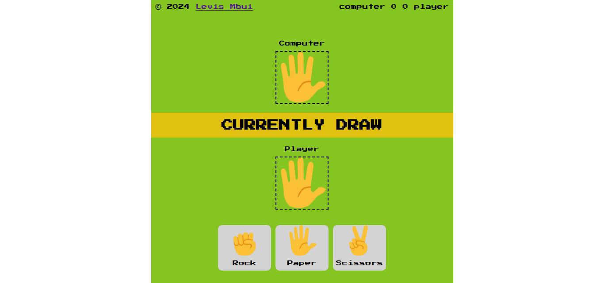

# Description
Built a rock, paper, scissors game as a follow up to JavaScript learning as the third week's weekend assessment at the Teach2Give bootcamp.

# Interface

    

## Rules

- A rock beats scissors.
- scissors beat paper by cutting it.  
- paper beats rock by covering it.

## Instructions

To enjoy this simple rock paper scissors game that I created simply click on this [link]().
